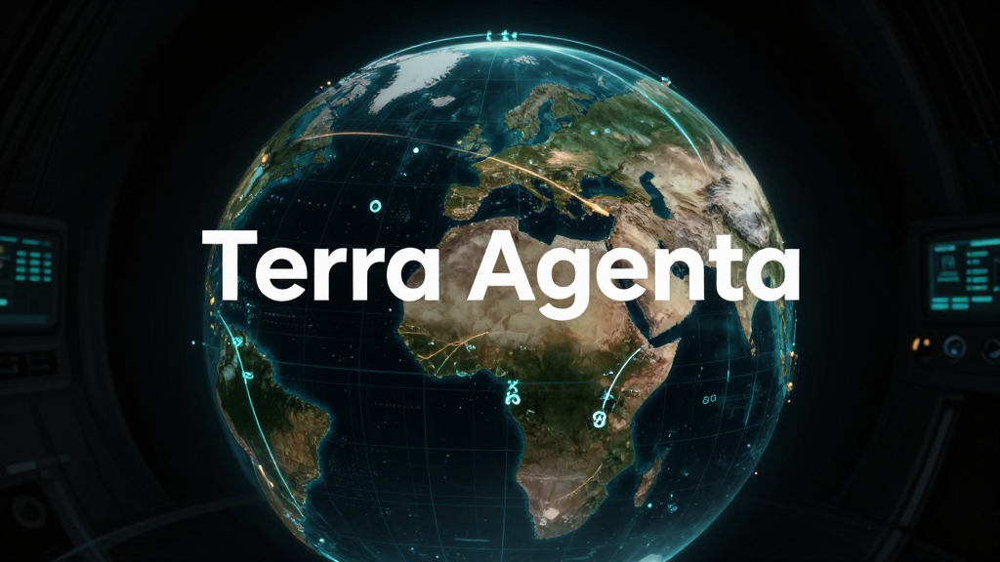

# Terra Agenta



Terra Agenta is an agent-native geospatial browser prototype: a shared 3D world interface where a human and an AI agent can inspect places, move through spatial context, capture evidence, and reason about the physical world from the same live scene.

This repo currently contains the Phase 0 globe spike: an Electron + React + Cesium desktop app with camera presets, live world-state readout, screenshot capture, and optional Google Photorealistic 3D Tiles support.

## Why this exists

Most map and globe products are designed as human-facing UIs. Agents can look at screenshots or brittle browser state, but they do not get a clean instrumented environment: camera, coordinates, layers, captures, observations, and tool-callable actions.

Terra Agenta flips that around.

Instead of asking an agent to automate Google Earth, the goal is to build the environment an agent should have had in the first place: a world browser with structured state, controllable navigation, evidence capture, and eventually MCP/tool-native access to geospatial services.

> A browser for the physical world, built for human + AI co-navigation.

## Current prototype

The Phase 0 app includes:

- Electron desktop shell
- React renderer powered by Vite
- CesiumJS globe view
- OpenStreetMap base imagery fallback
- Optional Google Photorealistic 3D Tiles via Maps Tiles API key
- Preset flights for Portland, Mount Hood, and Lower Manhattan
- Live camera/world-state panel
- Screenshot capture with recent capture cards
- Base globe toggle and camera reset controls

## Product direction

Terra Agenta is intended to grow into an agent-native spatial cockpit with:

- agent-controllable camera and navigation
- structured world state exposed to AI tools
- multimodal viewport inspection
- geocoding, places, elevation, OSM, remote sensing, and map-layer grounding
- annotations, observations, evidence cards, screenshots, and mission reports
- persistent place/session memory
- local/open-model-friendly workflows
- policy-aware provider abstraction for imagery and street-level data

The core design principle:

> Do not automate the human UI. Build the agent-native substrate.

## Tech stack

- Electron 39
- React 19
- TypeScript 5
- Vite 6
- CesiumJS
- vite-plugin-static-copy for Cesium static assets
- lucide-react for UI icons

## Getting started

### Prerequisites

- Node.js 22+ recommended
- npm
- Optional: Google Maps Tiles API key for photorealistic 3D tiles

### Install

```bash
npm install
```

### Configure optional Google 3D Tiles

The app works without a Google key using the base Cesium/OpenStreetMap globe. To enable Google Photorealistic 3D Tiles, create a local environment file:

```bash
cp .env.example .env.local
```

Then set one of these variables:

```bash
VITE_GOOGLE_MAP_TILES_API_KEY=your_key_here
# or
VITE_GOOGLE_MAPS_TILES_API_KEY=your_key_here
```

Do not commit real API keys.

### Run in development

```bash
npm run dev
```

This starts the Vite renderer on `127.0.0.1:5173`, waits for it to be ready, compiles the Electron main process, and opens the desktop app.

### Typecheck

```bash
npm run typecheck
```

### Build

```bash
npm run build
```

## Project structure

```text
terra-agenta/
├── assets/
│   └── terra-agenta-hero.png
├── src/
│   ├── main/
│   │   └── main.ts          # Electron main process
│   ├── renderer/
│   │   ├── App.tsx          # Cesium globe UI and controls
│   │   ├── main.tsx         # React entrypoint
│   │   └── styles.css       # Dark cockpit UI
│   └── shared/
│       └── world.ts         # Shared world/camera/capture types
├── vite.config.ts           # Vite + Cesium static asset config
├── package.json
└── world-browser-build-proposal.md
```

## Environment variables

| Variable | Required | Purpose |
| --- | --- | --- |
| `VITE_GOOGLE_MAP_TILES_API_KEY` | No | Google Photorealistic 3D Tiles API key |
| `VITE_GOOGLE_MAPS_TILES_API_KEY` | No | Alternate accepted name for the same key |

If no key is present, Terra Agenta falls back to the base globe.

## Roadmap

### Phase 0: Globe spike

- Desktop app shell
- Cesium globe
- Camera presets
- World-state panel
- Screenshot capture
- Optional Google 3D Tiles

### Phase 1: Agent tool surface

- Expose current world state to an agent
- Add tool-callable camera controls
- Add capture/export primitives
- Persist sessions locally

### Phase 2: Geospatial grounding

- Geocoding and place search
- OSM/context queries
- Layer overlays for GeoJSON/KML/CSV
- Elevation/terrain context
- Mission notes and evidence cards

### Phase 3: Multimodal inspection

- Viewport screenshot handoff to vision models
- Human-reviewed observation extraction
- Compare map/satellite/street-level context where provider terms allow
- Generate field notes and reports from saved evidence

### Phase 4: MCP-native world browser

- MCP server exposing navigation, capture, query, and annotation tools
- Agent-readable scene state
- Durable place memory
- Local/open-model workflows

## Use cases

Early dogfood directions include:

- UFO/UAP dataset geospatial investigation
- OSINT-style public-record and place-context research
- site selection and neighborhood inspection
- infrastructure and access-road analysis
- civic, environmental, and urban-planning exploration
- guided education and world-tour experiences

Terra Agenta should be treated as an investigation instrument, not a claim machine. Preserve provenance, expose uncertainty, and keep human review in the loop.

## Development notes

- Cesium static assets are copied from `node_modules/cesium/Build/Cesium` into the Vite build via `vite-plugin-static-copy`.
- `CESIUM_BASE_URL` is defined as `/cesium` in `vite.config.ts`.
- The Electron renderer runs with `contextIsolation`, `sandbox`, and no Node integration.
- Screenshot capture uses Cesium's canvas with `preserveDrawingBuffer` enabled.
- The app intentionally keeps world state as structured TypeScript types in `src/shared/world.ts` so it can later become an agent/MCP boundary.

## Status

Prototype. Sharp edges expected. The thesis is bigger than the current code: Phase 0 proves the basic desktop globe cockpit; the next important step is making the world state and navigation actions agent-addressable.

## License

No license has been selected yet.
